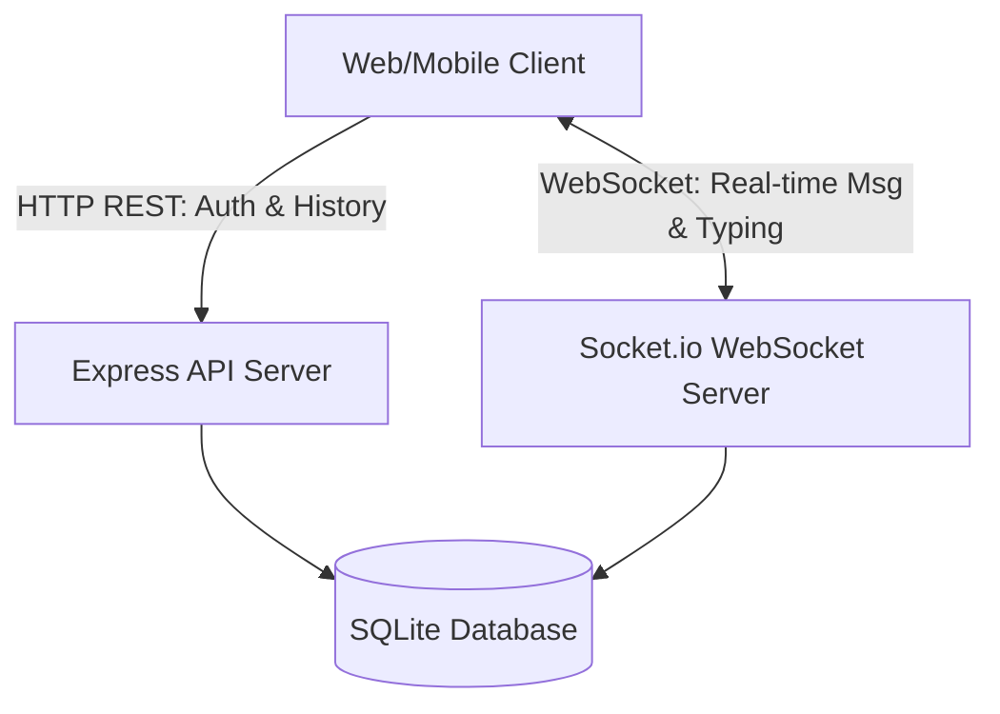
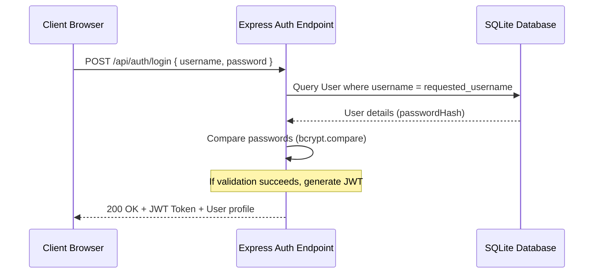
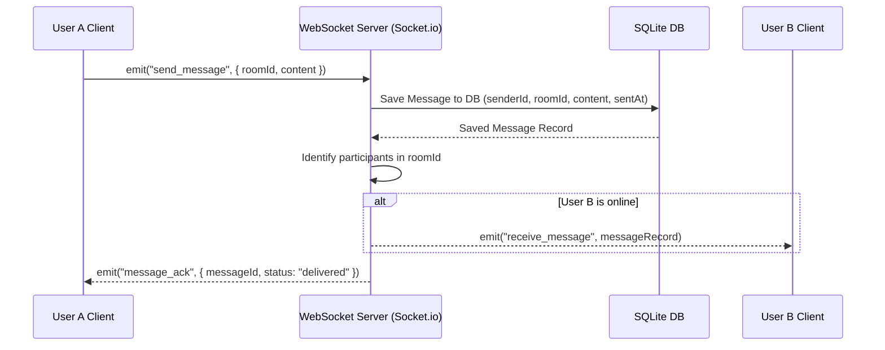

# Architecture Design - ChatConnect

## 1. High-Level Architecture
ChatConnect uses a classic **Client-Server Architecture** configured with a standard three-tier stack: Frontend client, Backend application server, and Database storage engine. In addition to standard HTTP requests, the architecture integrates a persistent duplex **WebSocket layer** to handle real-time messaging, typing events, and user presence events.



---

## 2. Component breakdown

### 2.1 Frontend Client
* **Framework:** React.js powered by Vite for fast hot-module-reloading (HMR) and optimized client-side bundles.
* **Styling:** Vanilla CSS for maximum performance, clean visual layouts, and responsive responsive queries.
* **State Management:** React Context API or standard `useState`/`useReducer` hooks for active session management, user directory caching, and selected chat history lists.
* **WebSocket Client:** `socket.io-client` for real-time connection and event listeners.

### 2.2 Backend Application Server
* **Environment:** Node.js runtime.
* **HTTP Framework:** Express.js for routing, REST endpoints, and middleware integrations (CORS, body-parser, auth guards).
* **Real-time Server:** Socket.io configured over the standard Node HTTP server to handle connection handshakes, namespaces, and room creation/joining.
* **ORM:** Prisma ORM to simplify query generation, migrations, and schema design.

### 2.3 Database Tier
* **Engine:** SQLite. Chosen for self-contained, serverless zero-configuration operation, making it ideal for immediate local setup, development, and testing. It stores credentials, rooms, participants, and chat logs persistently on disk.

---

## 3. Communication Protocols

### 3.1 HTTP REST API (Stateless)
Used for initialization, credentials administration, and database queries that do not require streaming capabilities.
* **JSON Web Tokens (JWT):** Passed via the `Authorization` header to authenticate REST requests.

### 3.2 WebSockets (Stateful / Duplex)
Used for instantaneous communication, status reporting, and interaction events.
* Socket handshake validates the JWT to register connection ownership and map the Socket ID to the corresponding Database User ID.

---

## 4. Authentication Flow


---

## 5. Message Flow (Sending and Receiving)
Below is the execution flow when User A sends a message to User B:



---

## 6. Project Folder Structure
Below is the proposed layout of the directory structure:

```text
chat-app/
├── backend/
│   ├── src/
│   │   ├── controllers/      # Route handlers (auth, chats, messages)
│   │   ├── middleware/       # Authentication guards, error logging
│   │   ├── models/           # Prisma schemas & DB interfaces
│   │   ├── socket/           # Socket.io connection handlers & logic
│   │   ├── app.js            # Express app configuration
│   │   └── server.js         # Entry point (HTTP + WebSocket server start)
│   ├── prisma/               # Prisma migrations & schema files
│   ├── package.json
│   └── .env
├── frontend/
│   ├── public/
│   ├── src/
│   │   ├── assets/           # Images, style utilities
│   │   ├── components/       # ChatWindow, Sidebar, LoginScreen, Dialogs
│   │   ├── hooks/            # useSocket hook, useAuth hook
│   │   ├── services/         # API HTTP requests (Axios / Fetch wrapper)
│   │   ├── context/          # Global AuthContext & SocketContext
│   │   ├── App.jsx           # Main router & layout router
│   │   └── main.jsx          # DOM rendering entry point
│   ├── package.json
│   └── vite.config.js
└── README.md
```
