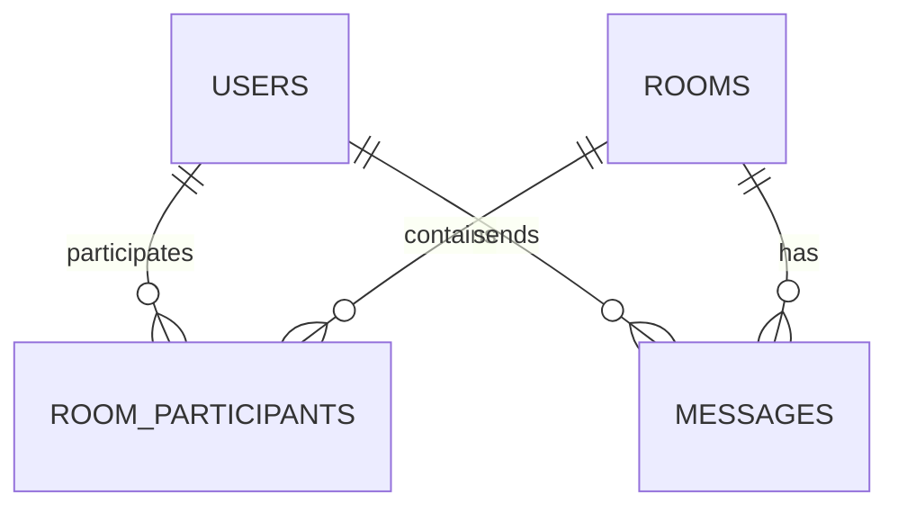

# Database Schema Design - ChatConnect

To ensure portability and ease of setup, ChatConnect uses **SQLite** (structured via **Prisma ORM** schemas). Below is the relational design for our persistent data store.

---

## 1. Entity Relationship Overview


---

## 2. Table Specifications

### 2.1 Users Table (`users`)
Stores registration information, authentication data, and account state parameters.

| Column Name | Data Type | Key Type | Nullable | Description / Constraints |
| :--- | :--- | :--- | :--- | :--- |
| `id` | VARCHAR(36) | Primary Key | No | UUID generated at creation |
| `username` | VARCHAR(50) | Unique | No | Case-sensitive, user login identifier |
| `password_hash`| VARCHAR(255)| - | No | Salted bcrypt hash value |
| `is_online` | BOOLEAN | - | No | Presence state status (Default: false) |
| `last_seen_at` | TIMESTAMP | - | Yes | Timestamp of last websocket close |
| `created_at` | TIMESTAMP | - | No | Default: CURRENT_TIMESTAMP |

* **Relationships:**
  * Has many `RoomParticipant` entries (1:N).
  * Has many `Message` entries as a sender (1:N).

---

### 2.2 Rooms/Conversations Table (`rooms`)
Represents chat environments. A room can be a 1-to-1 conversation or a group.

| Column Name | Data Type | Key Type | Nullable | Description / Constraints |
| :--- | :--- | :--- | :--- | :--- |
| `id` | VARCHAR(36) | Primary Key | No | UUID unique identifier |
| `name` | VARCHAR(100) | - | Yes | Display name for group chats; Null for 1-to-1 |
| `is_group` | BOOLEAN | - | No | True: Group chat, False: 1-to-1 (Default: false) |
| `created_at` | TIMESTAMP | - | No | Default: CURRENT_TIMESTAMP |

* **Relationships:**
  * Has many `RoomParticipant` entries (1:N).
  * Has many `Message` records sent to this room (1:N).

---

### 2.3 Room Participants Table (`room_participants`)
Resolves the many-to-many (M:N) relationship between Users and Rooms, denoting membership and authorization.

| Column Name | Data Type | Key Type | Nullable | Description / Constraints |
| :--- | :--- | :--- | :--- | :--- |
| `id` | VARCHAR(36) | Primary Key | No | UUID unique record ID |
| `room_id` | VARCHAR(36) | Foreign Key | No | References `rooms(id)` (Cascade delete) |
| `user_id` | VARCHAR(36) | Foreign Key | No | References `users(id)` (Cascade delete) |
| `is_admin` | BOOLEAN | - | No | True if user can add/remove members (Default: false)|
| `joined_at` | TIMESTAMP | - | No | Default: CURRENT_TIMESTAMP |

* **Constraints:**
  * Unique constraint on composite key: `(room_id, user_id)`.
* **Relationships:**
  * Belongs to `Room` (N:1).
  * Belongs to `User` (N:1).

---

### 2.4 Messages Table (`messages`)
Stores message contents sent within any direct or group conversation context.

| Column Name | Data Type | Key Type | Nullable | Description / Constraints |
| :--- | :--- | :--- | :--- | :--- |
| `id` | VARCHAR(36) | Primary Key | No | UUID generated at creation |
| `room_id` | VARCHAR(36) | Foreign Key | No | References `rooms(id)` (Cascade delete) |
| `sender_id` | VARCHAR(36) | Foreign Key | No | References `users(id)` (Set Null on user deletion) |
| `content` | TEXT | - | No | The textual message body |
| `sent_at` | TIMESTAMP | - | No | Default: CURRENT_TIMESTAMP |

* **Relationships:**
  * Belongs to `Room` (N:1).
  * Belongs to `User` (N:1) as the author.

---

## 3. SQL DDL Generation script (Reference)
```sql
CREATE TABLE users (
    id TEXT PRIMARY KEY,
    username TEXT UNIQUE NOT NULL,
    password_hash TEXT NOT NULL,
    is_online BOOLEAN DEFAULT 0 NOT NULL,
    last_seen_at TIMESTAMP,
    created_at TIMESTAMP DEFAULT CURRENT_TIMESTAMP NOT NULL
);

CREATE TABLE rooms (
    id TEXT PRIMARY KEY,
    name TEXT,
    is_group BOOLEAN DEFAULT 0 NOT NULL,
    created_at TIMESTAMP DEFAULT CURRENT_TIMESTAMP NOT NULL
);

CREATE TABLE room_participants (
    id TEXT PRIMARY KEY,
    room_id TEXT NOT NULL,
    user_id TEXT NOT NULL,
    is_admin BOOLEAN DEFAULT 0 NOT NULL,
    joined_at TIMESTAMP DEFAULT CURRENT_TIMESTAMP NOT NULL,
    FOREIGN KEY(room_id) REFERENCES rooms(id) ON DELETE CASCADE,
    FOREIGN KEY(user_id) REFERENCES users(id) ON DELETE CASCADE,
    UNIQUE(room_id, user_id)
);

CREATE TABLE messages (
    id TEXT PRIMARY KEY,
    room_id TEXT NOT NULL,
    sender_id TEXT,
    content TEXT NOT NULL,
    sent_at TIMESTAMP DEFAULT CURRENT_TIMESTAMP NOT NULL,
    FOREIGN KEY(room_id) REFERENCES rooms(id) ON DELETE CASCADE,
    FOREIGN KEY(sender_id) REFERENCES users(id) ON DELETE SET NULL
);
```
